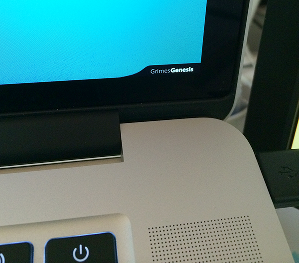

Ubersicht CoCo Now Playing widget
=================================

Using Ubersicht displays current track playing at CoCoMpls Downtown on your desktop.
[Ubersicht](http://tracesof.net/uebersicht/) is a GeekTool type of utility for Mac OS X that
let's you run system commands and display their output on your desktop.

## requirements
You must be using a Mac running OS X 10.9 or above (a Ubersicht requirement) and have
downloaded and installed Uberischt. You should also be comfortable modifying a source file,
to update the last.fm api key variable with your key. Finally you should also have a last.fm api key.

## to use
Drop the `coco_nowPlaying.widget` folder into your Ubersicht widgets folder.

### setup
You'll need to have a **last.fm api key**, which you can acquire from http://www.last.fm/api
Plug that key into the first line of the `index.coffee` file and then you should be ready to go.

## more info
I took inspiration from http://beautifulblood.deviantart.com/art/Unnamed-255040591

The widget is meant to blend into the black bevel of the MacBook Pro retina display but
should still look great on MacBook Airs as well.

